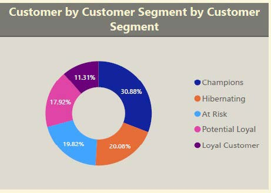
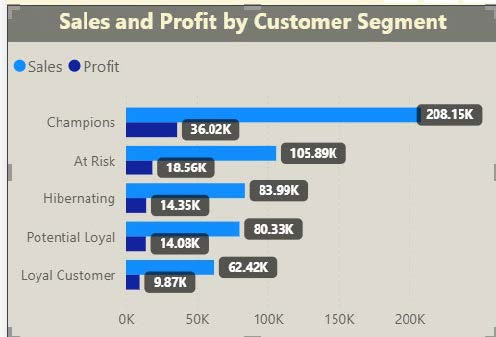
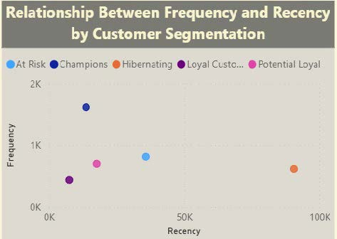
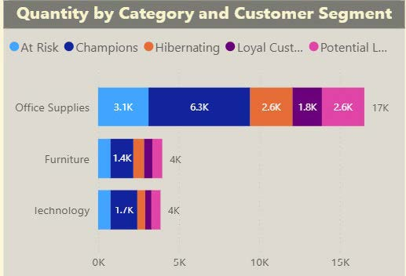
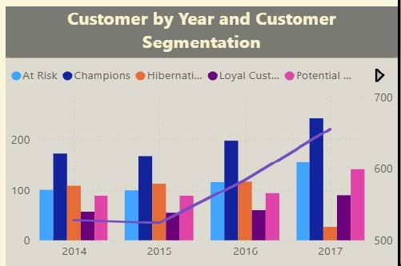

# Analisis Objektif
  Mengetahui Segmentasi pelanggan berdasarkan Recency, Frequency, dan Monetary untuk memahami pola perilaku pelanggan dan menemukan strategi pemasaran yang tepat.

# Analisis Bisnis
1. Segmen RFM mana yang paling banyak jumlah pelanggannya?
-> Jawaban : Berdasarkan visualisasi di atas, segmen pelanggan Champions merupakan yang paling dominan, mencakup 30.88% dari total pelanggan. Hal ini menunjukkan bahwa proporsi pelanggan yang aktif, loyal, dan memiliki kontribusi nilai tinggi terhadap bisnis cukup besar. Untuk menjaga keberlanjutan loyalitas mereka, bisnis dapat menerapkan strategi seperti pemberian promo eksklusif, akses lebih awal ke produk baru, atau program apresiasi pelanggan prioritas.
Sementara itu, segmen Hibernating mencakup 20.08% dari pelanggan. Ini menunjukkan bahwa sebagian pelanggan sudah lama tidak melakukan transaksi, berpotensi kehilangan minat atau berpindah ke kompetitor. Untuk segmen ini, perlu dilakukan kampanye yang menarik seperti penawaran terbatas, diskon personal, atau konten pengingat. Namun, jika setelah beberapa upaya mereka tetap tidak merespons, pelanggan ini dapat dikeluarkan dari prioritas utama strategi retensi agar sumber daya dapat difokuskan ke segmen yang lebih responsif. Adapun segmen Loyal Customer hanya 11.31%, yang artinya ada peluang untuk menaikkan segmen Potential Loyal dan At Risk menjadi Loyal melalui loyalty program.

  

2. Bagaimana kontribusi penjualan dan profit dari masing-masing segmen RFM?
-> Jawaban : Berdasarkan visualisasi di atas, segmen Champions memberikan kontribusi terbesar terhadap kinerja bisnis, dengan total sales sebesar 208.15K dan profit mencapai 36.02K. Hal ini sejalan dengan karakteristik pelanggan dalam segmen ini, yaitu pelanggan yang sering bertransaksi, berbelanja dalam jumlah besar, dan baru-baru ini aktif, menjadikannya segmen paling bernilai tinggi.
Segmen At Risk berada di posisi kedua dengan kontribusi sales sebesar 105.89K dan profit sebesar 18.56K. Meskipun pelanggan dalam segmen ini sudah jarang bertransaksi, mereka memiliki riwayat pembelian yang cukup baik, menunjukkan adanya potensi untuk dikembalikan menjadi pelanggan aktif. Oleh karena itu, mereka adalah target strategis untuk kampanye reaktivasi, seperti penawaran khusus atau pengingat personal. Segmen lainnya seperti Hibernating, Potential Loyal, dan Loyal Customer menunjukkan kontribusi yang lebih rendah baik dari sisi sales dan profit.

  

3. Apakah terdapat pola hubungan antara skor Recency dan Frequency yang mencerminkan loyalitas pelanggan?
-> Jawaban : Segmen champions berada di frequency tertinggi dan recency paling rendah, artinya mereka sering dan baru-baru ini melakukan transaksi, menunjukkan loyalitas yang tinggi dan harus dipertahankan. Kemudian, At Risk menempati posisi frequency menengah hingga tinggi, namun recency yang cukup besar. Artinya, pelanggan sempat loyal, namun mulai tidak aktif.Oleh karena itu, segmen At Risk ideal menjadi target program reaktivasi. Loyal Customer ada di frekuensi rendah dan recency juga tinggi, kasus ini beda dengan konsep “semakin loyal, maka semakin sering dibeli”, kemungkinan segmen loyal customer itu dulunya sebagai customer loyal, namun performanya menurun yang bisa jadi karena produk atau layanan kurang menarik.

  

4. Kategori produk apa yang paling sering dibeli oleh pelanggan di setiap segmen RFM?
-> Jawaban : Berdasarkan visualisasi di atas, kategori produk Office Supplies merupakan kategori yang paling sering dibeli oleh seluruh segmen pelanggan RFM, dengan total kuantitas mencapai sekitar 17K unit. Segmen Champions mendominasi pembelian dalam kategori ini
dengan kontribusi sekitar 6.3
K unit, diikuti oleh segmen At Risk (3.1K) dan Potential Loyal (2.6K). Hal ini menunjukkan bahwa pelanggan terbaik (Champions) memiliki preferensi tinggi terhadap produk Office Supplies, yang dapat dimanfaatkan untuk strategi penawaran eksklusif atau paket bundling khusus. Sementara itu, segmen Hibernating dan Loyal Customer juga masih tercatat membeli kategori ini, meskipun dalam volume yang lebih rendah. namun produk jenis Office Supplies tetap menjadi entry point produk yang potensial untuk retargeting dan reaktivasi.
Kategori Furniture dan Technology menunjukkan volume pembelian yang jauh lebih kecil yaitu 4K unit, namun tetap dibeli oleh semua segmen secara relatif merata. Strategi up selling atau pemasaran produk bisa diprioritaskan pada kategori ini untuk meningkatkan engagement pelanggan di luar kebutuhan rutin seperti Office Supplies.

  

5. Bagaimana perkembangan jumlah pelanggan pada masing-masing segmen RFM dari waktu ke waktu?
-> Jawaban : Berdasarkan visualisasi di atas, jumlah pelanggan secara keseluruhan mengalami peningkatan yang konsisten dari tahun 2014 hingga 2017, yang tercermin dari garis tren ungu yang naik. Segmen Champions menunjukkan pertumbuhan paling signifikan dan konsisten dalam empat tahun terakhir, menjadi segmen pelanggan terbesar pada tahun 2017. Artinya bahwa pengalaman pelanggan yang baik berhasil mempertahankan dan meningkatkan pelanggan berkualitas tinggi. Segmen At Risk juga menunjukkan tren peningkatan yang stabil, namun bisa menjadi perhatian karena pelanggan dalam kategori ini memiliki riwayat belanja tinggi tetapi mulai jarang aktif. Mereka merupakan target prioritas untuk program reaktivasi agar tidak berpindah ke segmen pasif.
Sebaliknya, segmen Hibernating mengalami penurunan tajam pada tahun 2017, yang bisa diartikan positif (berhasil di-reaktivasi), atau negatif (banyak pelanggan hilang). Segmen Loyal Customers dan Potential Loyal menunjukkan pertumbuhan moderat, menunjukkan adanya peluang besar untuk dikembangkan menjadi Champions melalui program loyalitas.

  
